# Canton Chain 入门教程：基于 Loop Wallet Demo

> 本教程面向 Canton 链初学者，以 Loop Wallet 示例项目为主线，只介绍理解 Demo 所必需的知识。所有代码示例均来自本项目的实际实现。

---

## 目录

1. [Canton Chain 基础概念](#1-canton-chain-基础概念)
2. [Template ID 与 Daml 模型](#2-template-id-与-daml-模型)
3. [Loop SDK 与 Wallet 架构](#3-loop-sdk-与-wallet-架构)
4. [Demo 项目走读](#4-demo-项目走读)
5. [关键代码模式](#5-关键代码模式)

---

## 1. Canton Chain 基础概念

### 1.1 Canton 是什么？

Canton 是一个**隐私优先的分布式账本**，由 Digital Asset 公司开发。它基于 Daml 智能合约语言，核心特点是：

- **子交易隐私（Sub-transaction Privacy）**：每笔交易的参与方只看到自己需要看到的数据，而非全网广播。
- **去中心化同步**：不同节点之间通过 "synchronizer" 同步合约状态，但只有利益相关方才能解密相关数据。

简单理解：Canton 像是一个"只跟当事人共享数据"的区块链。你持有的资产、收到的凭证，只有你和交易对手方知道。

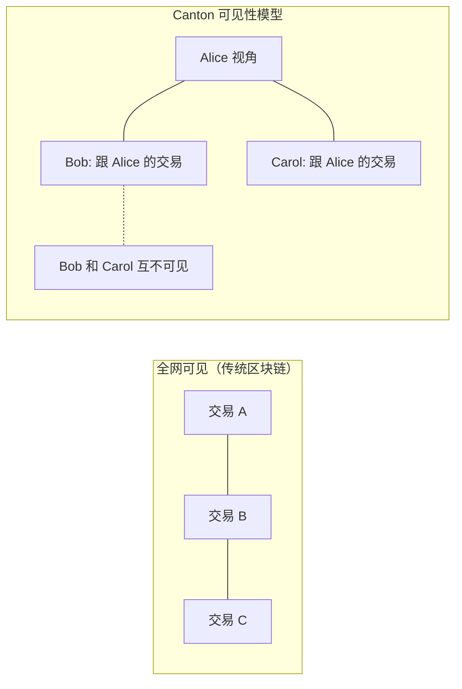

### 1.2 核心概念

在 Canton / Daml 中有四个核心概念，理解它们就能理解整个 Demo：

| 概念 | 说明 | 在本项目中的例子 |
|------|------|------------------|
| **Party** | 账本上的参与者/身份 | 你的钱包地址，如 `your-id::1220abc...` |
| **Template** | 合约的"类"，定义了数据结构和可执行操作 | `CredentialOffer`、`Holding`、`TransferInstruction` |
| **Contract** | Template 的"实例"，代表一笔具体的业务数据 | 某一条待领取的凭证、某一笔待接收的转账 |
| **Choice** | 合约上可执行的操作，类似"方法调用" | `CredentialOffer_Accept`、`TransferInstruction_Accept` |

它们之间的关系：

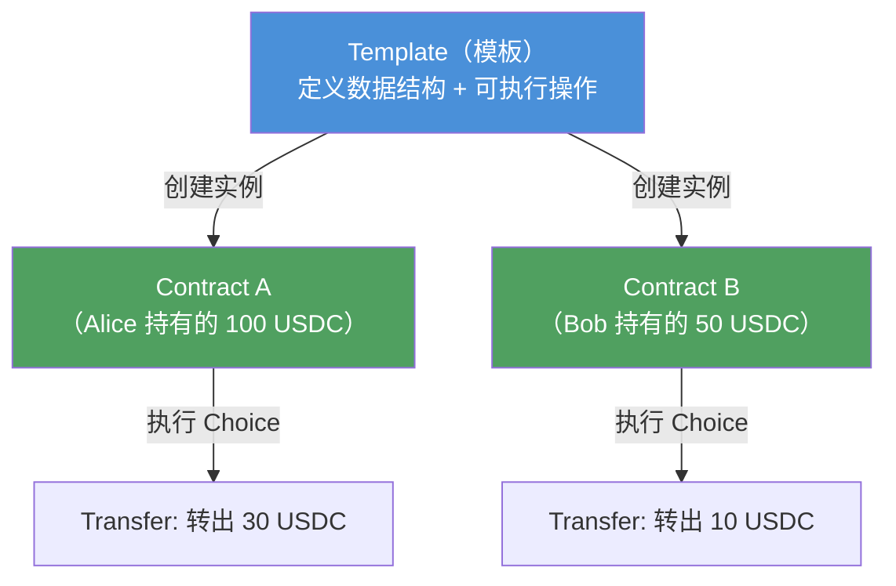

#### Party ID 的结构

在本 Demo 中，你会经常看到这样的 Party ID：

```
participant-id::1220public-key-hash
```

例如：`7da3a2b639137d37d8f86dd4b2625873::12208020d3dcfdefb7ee787d68e...`

- 前半部分是 **participant ID**（节点标识）
- `::` 是分隔符
- 后半部分是 **公钥哈希**（party 唯一标识）

#### 合约交互模型

在 Canton 上，与合约交互的模式是：

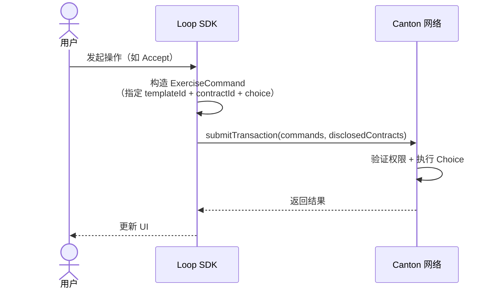

关键点：每次操作都需要明确指定 **要在哪个模板的哪个合约上执行哪个 Choice**。这就是下一节 Template ID 的作用。

---

## 2. Template ID 与 Daml 模型

### 2.1 Template ID 的格式与含义

Template ID 是 Canton 中定位合约模板的唯一标识符，格式如下：

```
#package-id:ModuleName:TemplateName
```

以本项目中的凭证模板为例：

```
#utility-credential-app-v0:Utility.Credential.App.V0.Model.Offer:CredentialOffer
```

拆解来看：

| 部分 | 值 | 含义 |
|------|-----|------|
| `#` | 前缀 | 表示为 `#` 格式的模板 ID |
| `package-id` | `utility-credential-app-v0` | Daml 包的标识符（上传 DAR 时指定） |
| `ModuleName` | `Utility.Credential.App.V0.Model.Offer` | Daml 模块路径（对应 `.daml` 文件中的 `module` 声明） |
| `TemplateName` | `CredentialOffer` | 模板名称（对应 `.daml` 文件中的 `template` 声明） |

本项目中使用的四个 Template ID：

```
# 持仓查询（按接口查询）
#splice-api-token-holding-v1:Splice.Api.Token.HoldingV1:Holding

# 凭证申请（查看待领取的凭证）
#utility-credential-app-v0:Utility.Credential.App.V0.Model.Offer:CredentialOffer

# 已持有的凭证
#utility-credential-v0:Utility.Credential.V0.Credential:Credential

# 转账指令（查看待接收的转账）
#splice-api-token-transfer-instruction-v1:Splice.Api.Token.TransferInstructionV1:TransferInstruction
```

### 2.2 如何找到 Template ID？

Template ID 的完整格式是 `#package-id:ModuleName:TemplateName`，其中 **ModuleName** 和 **TemplateName** 可以从 Daml 源码或 API 文档中找到，但 **package-id** 是 DAR 包上传到 Canton 网络时由系统分配的短标识符，无法从文档直接获取。

因此，找到完整 Template ID 需要两步配合：

#### 方式一：查阅 Daml API 文档（获取 ModuleName 和 TemplateName）

Digital Asset 提供了 DevNet 的 API 参考文档，其中列出了所有公开的 Daml 模板和接口的模块路径、模板名称、字段定义、Choice 及其参数：

👉 [Daml API Reference (DevNet)](https://docs.digitalasset.com/utilities/devnet/reference/daml-api-reference/api-reference.html)

另外，How-to 示例页面提供了更贴近实际场景的代码参考：

👉 [How-to Examples (DevNet)](https://docs.digitalasset.com/utilities/devnet/how-tos/examples.html)

在文档中可以按包名浏览，找到你需要的模板的 `ModuleName` 和 `TemplateName`，以及 Choice 的签名和参数类型。但文档中**不包含 `package-id`**，这部分需要从方式二获取。

#### 方式二：从 DAR 文件生成类型定义（获取完整 Template ID）

如果你有 `.dar` 文件（Daml Archive），可以使用 DPM CLI（Daml Package Manager）生成 TypeScript 类型文件。生成的代码中会包含完整的 `package-id`，补全方式一缺失的部分。

官方提供了各版本的 DAR 文件下载：👉 [DAR Versions (DevNet)](https://docs.digitalasset.com/utilities/devnet/reference/dar-versions/dar-versions.html)

```bash
# 安装 dpm（如未安装）
npm install -g @digitalasset/daml-package-manager

# 从 dar 文件生成 TypeScript 类型
dpm generate types --input path/to/package.dar --output ./generated-types/
```

生成的 TypeScript 文件通常包含：

```typescript
// 示例：生成的类型文件中会包含完整的 Template ID
// package-id 来自 DAR 的元数据
export const templateId = "#utility-credential-app-v0:Utility.Credential.App.V0.Model.Offer:CredentialOffer";

export namespace Utility.Credential.App.V0.Model.Offer {
  export interface CredentialOffer {
    id: string;
    description: string;
    issuer: string;
    holder: string;
    claims: Claim[];
  }

  export namespace CredentialOffer {
    export interface AcceptFree { /* ... */ }
    export interface Reject { reason: string; }
  }
}
```

**总结**：方式一提供模板字段和 Choice 的参考信息，方式二提供完整的 `package-id`，两者搭配即可构造出准确的 Template ID。

### 2.3 模板 vs 接口：两种查询方式

在 Canton 中有两种方式查询合约：

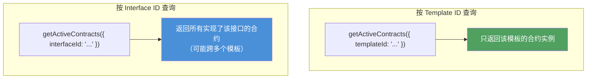

本项目中的例子：
- 查询持仓用 **Interface ID**：`#splice-api-token-holding-v1:Splice.Api.Token.HoldingV1:Holding`（因为不同代币可能对应不同的模板，但都实现了同一个 `Holding` 接口）
- 查询凭证用 **Template ID**：`#utility-credential-app-v0:Utility.Credential.App.V0.Model.Offer:CredentialOffer`（只需要特定模板的合约）

---

## 3. Loop SDK 与 Wallet 架构

### 3.1 Loop SDK 的角色

Loop SDK（`@fivenorth/loop-sdk`）是一个封装了 Canton 底层交互的 JavaScript SDK。它帮我们处理了：

- **身份认证**：用 Ed25519 私钥签名，向 Canton 网络证明身份
- **合约查询**：封装 `getActiveContracts` / `getHolding` 等 API
- **交易构造**：封装 `submitTransaction`，包括 Choice Context 和 Disclosed Contracts
- **Gas 估算**：在提交交易前预估所需 Gas

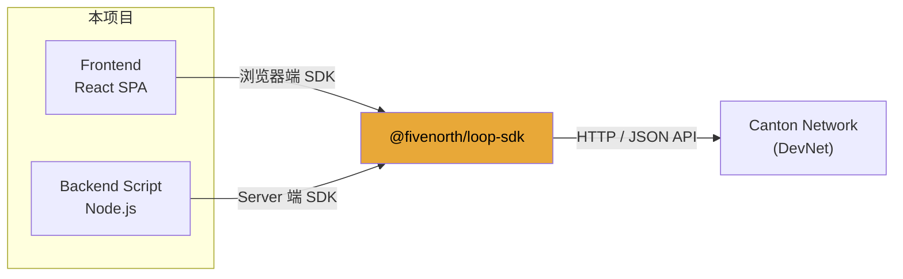

### 3.2 Demo 项目架构

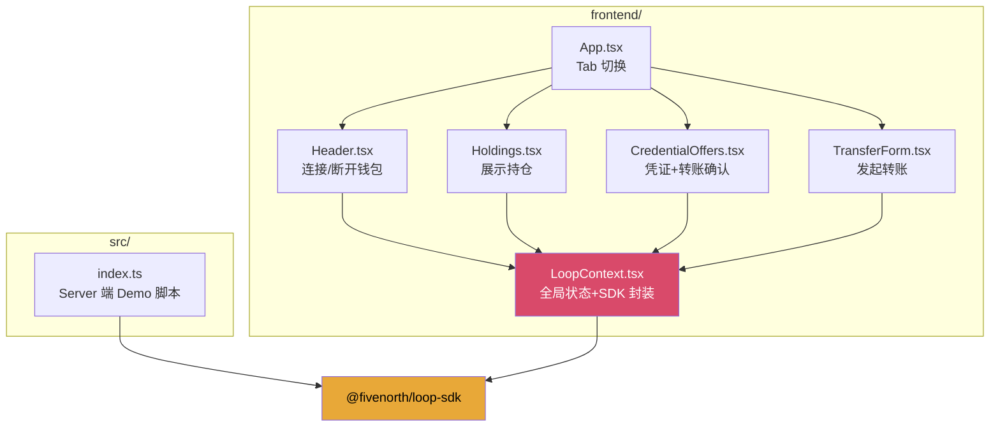

`LoopContext.tsx` 是本项目的核心：它初始化 SDK、管理连接状态、轮询数据，并暴露所有操作方法。

---

## 4. Demo 项目走读

### 4.1 前置准备

在运行 Demo 之前，你需要先申请一个 Loop 钱包。发送申请邮件至：

📧 **peter@fivenorthgroup.com**

申请通过后，你将获得以下信息并写入 `.env`：

```bash
# Ed25519 私钥（Hex 编码，32 字节 seed 或 64 字节完整密钥）
PRIVATE_KEY=your_private_key_here

# 你的 Party ID
PARTY_ID=your_party_id_here

# 网络环境：local / devnet / mainnet
NETWORK=devnet
```

Party ID 由你的私钥派生而来。通常申请通过后对方会直接提供；你也可以在使用 Loop SDK 连接成功后，从返回的 Provider 中获取 `party_id`。

### 4.2 连接钱包

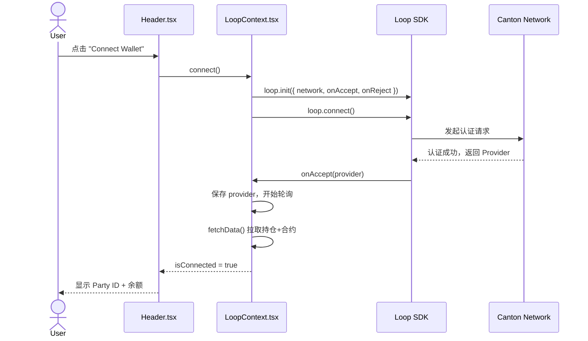

关键代码（`LoopContext.tsx`）：

```typescript
// 初始化 SDK
loop.init({
  appName: 'Loop Wallet dApp',
  network: 'devnet',
  onAccept: (provider) => {
    // 认证成功后拿到 provider
    setProvider(provider);
    setIsConnected(true);
  },
  onReject: () => {
    setIsConnecting(false);
  },
});

// 触发连接
await loop.connect();
```

### 4.3 查看持仓

连接成功后，Demo 会自动轮询持仓数据（每 8 秒）：

```typescript
// LoopContext.tsx — fetchData()
const [holdings, holdingContracts, credentialOffers, credentials] =
  await Promise.all([
    provider.getHolding(),                                    // 获取代币余额
    provider.getActiveContracts({ interfaceId: HOLDING_IF }), // 待接收的转账
    provider.getActiveContracts({ templateId: CRED_TMPL }),   // 待领取的凭证
    provider.getActiveContracts({ templateId: CRED_V0_TMPL }),// 已持有的凭证
  ]);
```

`Holdings.tsx` 组件将持仓数据渲染为卡片：

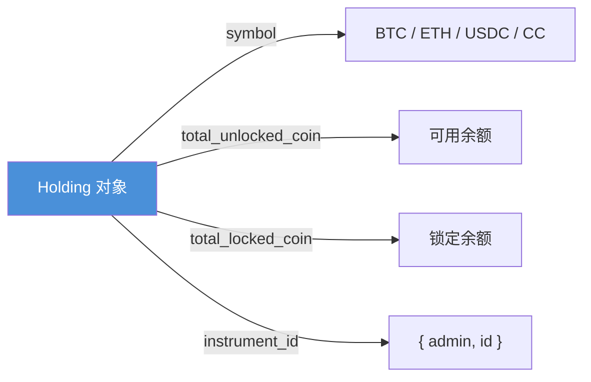

### 4.4 凭证（Credential）的领取与拒绝

凭证是 Canton 链上的身份/权限证明。比如，持有某个"白名单凭证"才能接收特定的代币转账。

#### 什么是 Credential？

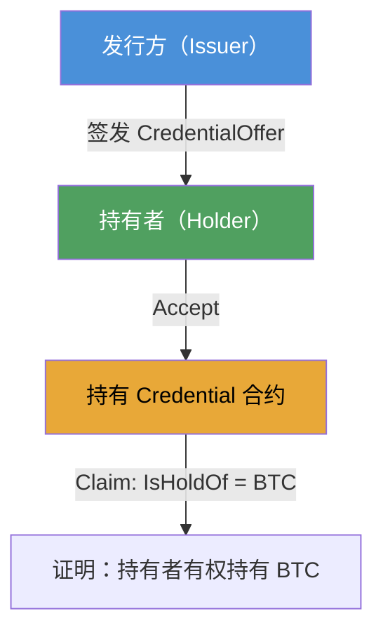

#### 操作流程

在 Demo 中，`CredentialOffers.tsx` 展示了两类待处理事项：

1. **待领取的凭证（Credential Offers）**：发行方给你发了凭证，等你确认
2. **待接收的转账（Transfer Holdings）**：别人给你转了代币，等你确认

接受凭证的核心代码：

```typescript
// 接受一个 Credential Offer
await provider.submitTransaction({
  commands: [{
    ExerciseCommand: {
      templateId: '#utility-credential-app-v0:Utility.Credential.App.V0.Model.Offer:CredentialOffer',
      contractId,  // 要操作的合约 ID
      choice: 'CredentialOffer_AcceptFree',  // 要执行的操作
      argument: {
        tag: 'CredentialOffer_AcceptFree',
        value: {},
      },
    },
  }],
  disclosedContracts: [],  // 需要披露给网络的合约
});
```

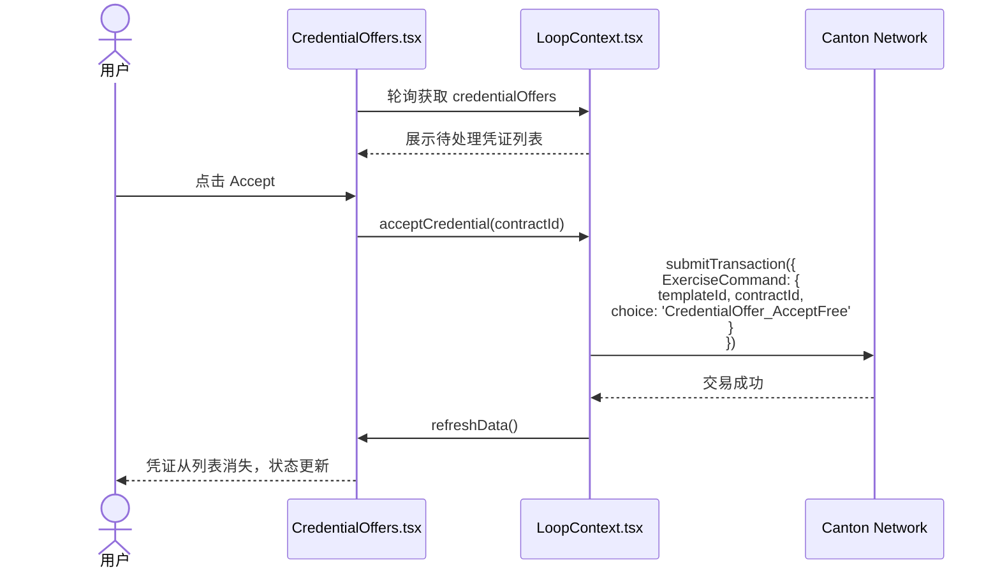

### 4.5 发起转账与 Gas 估算

#### 转账流程

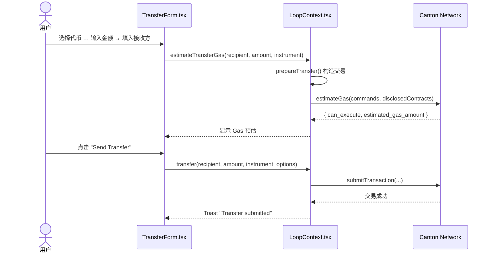

#### 关于 CC（Canton Coin）

CC 是 Canton 网络的 **Gas 代币**，用于支付交易手续费。在 DevNet 上，大多数操作是免费的（`requires_gas: false`），但在主网上需要消耗 CC。

Demo 中转账表单底部显示了：
- **CC Balance**：当前账户的 CC 余额
- **Estimated Gas**：预估本次交易需要消耗的 CC 数量

```typescript
// TransferForm.tsx — 提交前检查 Gas
if (!estimatedGas.can_execute) {
  // Gas 不足，阻止发送
  setToast({ message: `Cannot execute: estimated gas ${estimatedGas.estimated_gas_amount} CC`, type: 'error' });
  return;
}
```

#### 接收转账的特殊之处

接收转账比接收凭证复杂，因为需要提供 **Choice Context** 和 **Disclosed Contracts**：

1. 从 Registry API 获取 Choice Context（后端提供的"上下文数据"）
2. 找到与转账资产匹配的凭证合约（用于权限证明）
3. 将凭证合约作为 `disclosedContracts` 一起提交

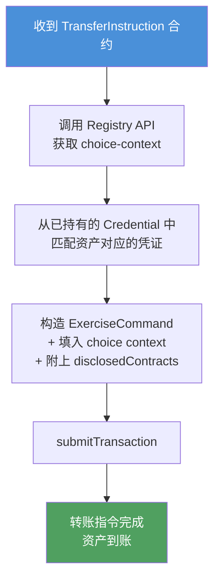

#### Registry API 说明

Registry API 是 Canton **Token Standard** 中定义的规范接口，由代币发行方（Operator Backend）提供。它的作用是：在执行某些 Choice 前，为调用方提供必需的**上下文数据（Choice Context）**和**需披露的合约（Disclosed Contracts）**。

以本项目接收转账为例：

```typescript
// 向 Registry API 请求接受转账所需的上下文
const choiceContextRes = await fetch(
  `${REGISTRY_URL}/registry/transfer-instruction/v1/${contractId}/choice-contexts/accept`,
  { method: 'POST', headers: { 'Content-Type': 'application/json' }, body: JSON.stringify({ ... }) }
);
const choiceContext = await choiceContextRes.json();

// choiceContext 返回的结构：
// {
//   choiceContextData: { values: { ... } },  // 上下文数据（如 receiver-credentials）
//   disclosedContracts: [ ... ]               // 需要一起提交的合约
// }
```

Registry API 的端点遵循固定的 URL 模式：

```
{operator-backend-url}/registry/{contract-type}/v1/{contractId}/choice-contexts/{choiceName}
```

| 路径参数 | 说明 | 示例 |
|----------|------|------|
| `contract-type` | 合约类型 | `transfer-instruction` |
| `contractId` | 具体合约 ID | `#contract-id` |
| `choiceName` | 要执行的 Choice 名称 | `accept` / `reject` |

#### Registry Base URL

完整的 Registry API 地址由 **Base URL** + **Admin Party ID** 组成：

```
{base-url}/{admin-party-id}/registry/...
```

其中 `{admin-party-id}` 是对应资产管理员（Instrument Admin）的 Party ID。不同环境的 Base URL 如下：

| 环境 | Base URL |
|------|----------|
| **Devnet** | `https://api.utilities.digitalasset-dev.com/api/token-standard/v0/registrars/` |
| **Testnet** | `https://api.utilities.digitalasset-staging.com/api/token-standard/v0/registrars/` |
| **Mainnet** | `https://api.utilities.digitalasset.com/api/token-standard/v0/registrars/` |

本项目使用的是 Devnet 环境：

```typescript
// LoopContext.tsx
const REGISTRY_URL = 'https://api.utilities.digitalasset-dev.com/api/token-standard/v0/registrars/192ae516-ec66-4dce-ace9-f237a95609c0::12200be238a3079e5c7b425e9e9c458eebd6a6991bf0ec7dd22b388be3bf0a8c57f1';
//                   └──────────── Base URL (Devnet) ─────────────┘└─────────────────── Admin Party ID ──────────────────────┘
```

Registry API 不仅用于获取 Choice Context，还可以查询资产元数据。例如，查询 Mainnet 上 Utility Operator 管理的所有资产：

```
https://api.utilities.digitalasset.com/api/token-standard/v0/registrars/auth0_007c6643538f2eadd3e573dd05b9::12205bcc106efa0eaa7f18dc491e5c6f5fb9b0cc68dc110ae66f4ed6467475d7c78e/registry/metadata/v1/instruments
```

📖 参考文档：
- [Operator Backend — Token Standard Endpoints](https://docs.digitalasset.com/utilities/devnet/overview/registry-user-guide/token-standard.html#operator-backend-token-standard-endpoints)
- [Splice Token Metadata Service](https://docs.canton.network/reference/splice-token-metadata-service)

### 4.6 Server 端脚本

`src/index.ts` 演示了如何在 Node.js 后端使用 Loop SDK：

```typescript
// 1. 初始化
loop.init({ privateKey, partyId, network });

// 2. 认证
await loop.authenticate();

// 3. 获取 Provider
const provider = loop.getProvider();

// 4. 查询数据
const holdings = await provider.getHolding();
const contracts = await provider.getActiveContracts({ templateId: '...' });
```

与前端的主要区别：后端使用**私钥直接签名**，不需要弹出钱包 UI。

---

## 5. 关键代码模式

### 5.1 SDK 初始化模式

```typescript
// 前端：依赖钱包 UI 交互
loop.init({
  appName: 'Loop Wallet dApp',
  network: 'devnet',
  onAccept: (provider) => { /* 连接成功 */ },
  onReject: () => { /* 用户拒绝 */ },
});
await loop.connect();

// 后端：直接用私钥认证
loop.init({ privateKey, partyId, network });
await loop.authenticate();
const provider = loop.getProvider();
```

### 5.2 统一的操作模式：ExerciseCommand

所有对 Canton 链的"写操作"都遵循同一个模式：

```typescript
await provider.submitTransaction({
  commands: [{
    ExerciseCommand: {
      templateId: '...',   // 操作哪个模板
      contractId: '...',   // 操作哪个合约实例
      choice: '...',       // 执行哪个 Choice
      argument: {           // Choice 的参数
        tag: '...',
        value: { /* ... */ },
      },
    },
  }],
  disclosedContracts: [    // 需要披露给网络的合约
    {
      templateId: '...',
      contractId: '...',
      createdEventBlob: '...',
      synchronizerId: '...',
    },
  ],
});
```

### 5.3 轮询模式

```typescript
// 连接后立即拉取，之后定时轮询
useEffect(() => {
  if (isConnected) {
    fetchData();
    pollRef.current = setInterval(fetchData, 8000); // 每 8 秒
  }
  return () => clearInterval(pollRef.current);
}, [isConnected, fetchData]);
```

---

## 总结

通过这个 Demo，你学到了：

1. **Canton 链核心概念**：Party、Template、Contract、Choice 及它们之间的关系
2. **Template ID**：如何从文档查找、如何从 DAR 文件生成类型、Template ID 与 Interface ID 的区别
3. **Loop SDK 的使用**：初始化、认证、查询持仓、构造交易
4. **ExerciseCommand 模式**：所有链上操作都遵循统一的命令格式
5. **凭证系统**：Credential 是权限管理的核心，转账接收需要匹配的凭证
6. **Gas 机制**：CC 是 Gas 代币，DevNet 上免费

### 下一步

- 阅读 [Daml API Reference](https://docs.digitalasset.com/utilities/devnet/reference/daml-api-reference/api-reference.html) 了解所有可用的模板和接口
- 查看 [How-to Examples](https://docs.digitalasset.com/utilities/devnet/how-tos/examples.html) 获取更贴近实际场景的代码参考
- 浏览 [Canton Network Integrations Overview](https://docs.canton.network/integrations/overview) 了解 Canton 生态中的集成方案全貌
- 阅读 [Loop SDK 源码与文档](https://github.com/fivenorth-io/loop-sdk) 深入了解 SDK 的能力边界和最新更新
- 使用 `dpm generate types` 从 DAR 文件生成 TypeScript 类型，获得更好的开发体验
- 在 DevNet 上运行本项目，实际操作一遍连接、查看持仓、领取凭证、发起转账的完整流程

---

> 本教程基于 [loop-wallet-test](.) 项目生成，项目源码位于本仓库中。
